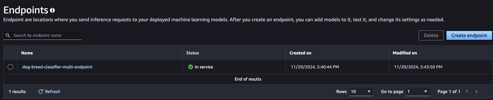

# Image Classification using AWS SageMaker

Use AWS Sagemaker to train a pretrained model that can perform image classification by using the Sagemaker profiling, debugger, hyperparameter tuning and other good ML engineering practices. This can be done on either the provided dog breed classication data set or one of your choice.

## Project Set Up and Installation
Enter AWS through the gateway in the course and open SageMaker Studio. 
Download the starter files.
Download/Make the dataset available. 

## Dataset
The provided dataset is the dogbreed classification dataset which can be found in the classroom.
The project is designed to be dataset independent so if there is a dataset that is more interesting or relevant to your work, you are welcome to use it to complete the project.

### Access
Upload the data to an S3 bucket through the AWS Gateway so that SageMaker has access to the data. 

## Hyperparameter Tuning
What kind of model did you choose for this experiment and why? Give an overview of the types of parameters and their ranges used for the hyperparameter search

Remember that your README should:
- Include a screenshot of completed training jobs
- Logs metrics during the training process
- Tune at least two hyperparameters
- Retrieve the best best hyperparameters from all your training jobs

## Debugging and Profiling
**TODO**: Give an overview of how you performed model debugging and profiling in Sagemaker
During the final testing of the model, the model was profiled and debugged to ensure that it was working as expected. 

The testing captured profiling and debugging information for the first 50 steps of the training job on a 5000ms interval capturing the following information:
- System metrics
- Framework metrics
- Detailed profiling information

### Results
**TODO**: What are the results/insights did you get by profiling/debugging your model?
The profiling and debugging information showed that the model was working as expected and that the training job was running smoothly.

However, the initialization took a long time due to s3 data transfer to disk. Perhaps using boto3 to download the data is not the most efficient way to get the data.
Using aws cli to download the data to the instance might be a better option. For example:
```
aws s3 cp s3://my-bucket/dataset /local/data --recursive --only-show-errors --no-progress --multipart-chunk-size 8MB
```
or 
```
aws s3 cp --endpoint-url https://s3-accelerate.amazonaws.com s3://my-bucket/dataset /local/data
```

However, the cpu utilization was very low, which could indicate that the model was not complex enough to require a lot of resources. Ideally, we would want to use GPU instances for training the model.

**TODO** Remember to provide the profiler html/pdf file in your submission.

See the [profiler report](ProfilerReport/profiler-output/profiler-report.html) for more information.

## Model Deployment
**TODO**: Give an overview of the deployed model and instructions on how to query the endpoint with a sample input.

The model was deployed using the Multi-Model endpoint. The models can be queried using the following code:

```python
import json

runtime_client = boto3.client("sagemaker-runtime")

endpoint_name = "dog-breed-classifier-multi-endpoint"
image_path = "dogImages/test/001.Affenpinscher/Affenpinscher_00003.jpg"

# Load the image as bytes
with open(image_path, "rb") as f:
    payload = f.read()

# Invoke the endpoint for core model
response = runtime_client.invoke_endpoint(
    EndpointName=endpoint_name,
    TargetModel="dog-breed-classifier/model.tar.gz",
    ContentType="application/x-image",
    Body=payload,
)

# Decode the response
result = response["Body"].read()
print("Prediction result:", json.loads(result))

# Invoke the endpoint for mobile model
response = runtime_client.invoke_endpoint(
    EndpointName=endpoint_name,
    TargetModel="dog-breed-classifier-mobile/model.tar.gz",
    ContentType="application/x-image",
    Body=payload,
)

# Decode the response
result = response["Body"].read()
print("Prediction result:", json.loads(result))
```


**TODO** Remember to provide a screenshot of the deployed active endpoint in Sagemaker.


**TODO** The submitted README file contains a screenshot of your hyperparameter tuning job that shows at least 2 different training runs and their results.

## Standout Suggestions
**TODO (Optional):** This is where you can provide information about any standout suggestions that you have attempted.

